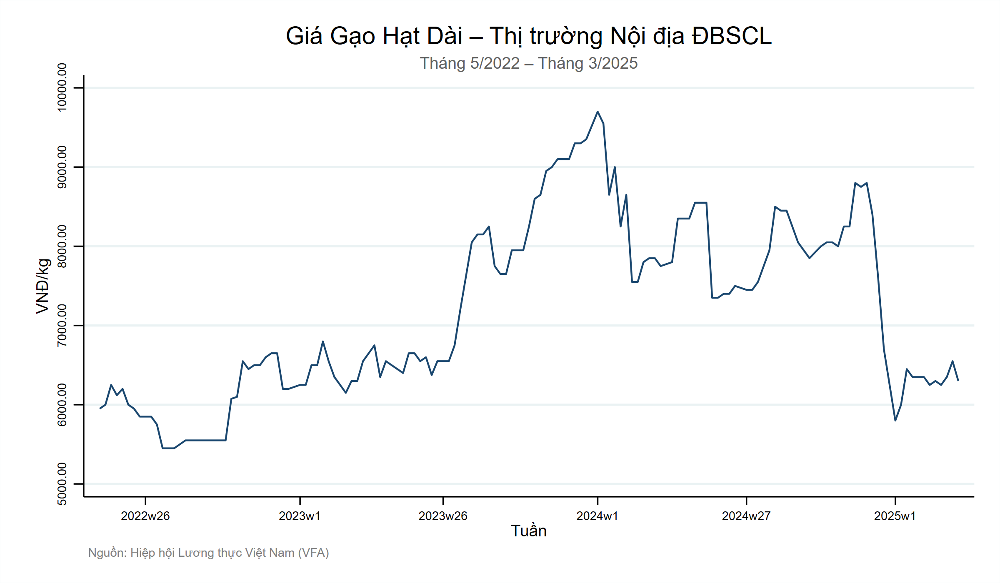
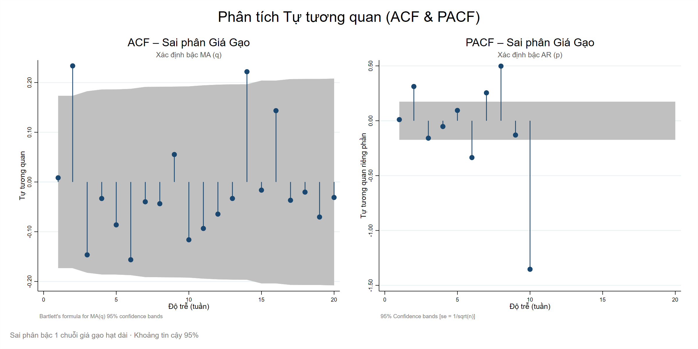
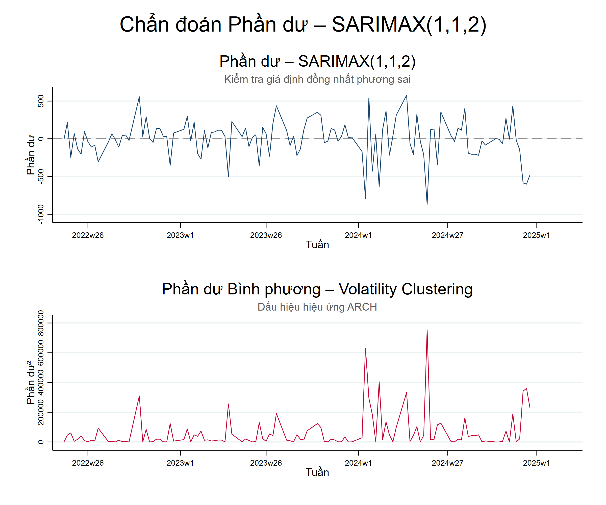
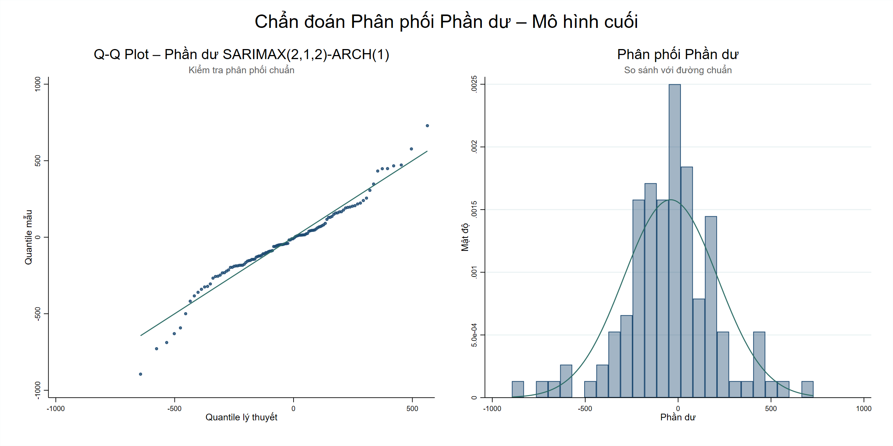
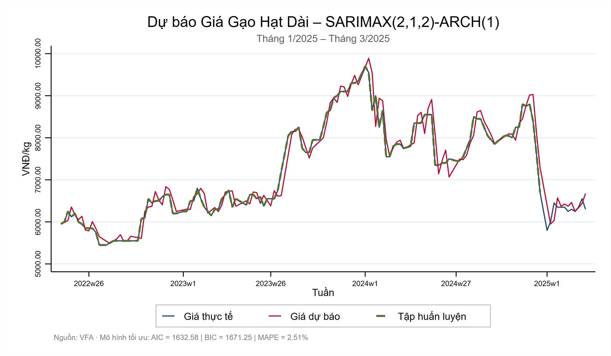
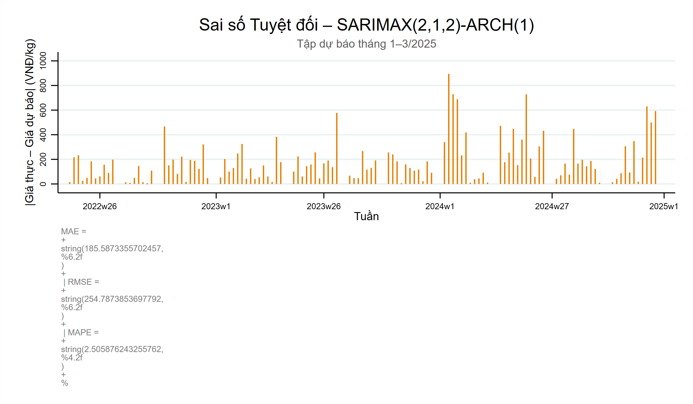

# Forecasting the Impact of Saltwater Intrusion on Rice Prices in Vietnam's Mekong Delta

> **Academic Research Paper** · University of Economics Ho Chi Minh City  
> Trương Minh Đạt · Nguyễn Hoàng Nga · Nguyễn Đào Kim Ngân · Nguyễn Minh Khương · Vũ Thái Tân

---

## Overview

This study quantifies the economic impact of saltwater intrusion on domestic rice prices in the Mekong Delta (ĐBSCL) — Vietnam's most critical agricultural region, contributing **50%+ of national rice output**. Using weekly time-series data and a hybrid SARIMAX–ARCH model, the research delivers short-term rice price forecasts with **MAPE of only 2.50%**, enabling early warning for farmers, traders, and policymakers.

---

## Why This Project Stands Out

- **Real-world relevance** — directly addresses climate change, food security, and rural livelihoods in one of Southeast Asia's most climate-vulnerable deltas
- **Novel methodology** — one of the first studies in Vietnam to combine SARIMAX + ARCH for rice price forecasting with multi-source climate and agricultural variables
- **High forecast accuracy** — MAPE of 2.50% and MAE of ~185 VND/kg against a price range of 8,000–10,000 VND/kg
- **Multi-source data integration** — merges hydrological, meteorological, and market data from five independent institutions
- **Policy-ready output** — model results directly applicable as an early-warning tool for market management and crop planning

---

## Research Problem

Saltwater intrusion in the Mekong Delta peaks during the dry season (Dec–Apr), when salinity levels regularly exceed 2–4‰ — the critical threshold for rice cultivation. In the historic 2015–2016 drought, over **159,000 ha of rice land** was completely destroyed. Beyond crop loss, intrusion creates cascading price volatility that harms both farmers and consumers.

**Key question:** Can we reliably forecast short-term rice prices by incorporating salinity, rainfall, cultivated area, and yield as exogenous inputs?

  
   
  <em>Figure 1 — Weekly long-grain rice prices in the Mekong Delta (May 2022 – Mar 2025). The sharp surge in 2023 and subsequent volatility highlight the forecasting challenge.</em>

---

## Data Sources

| Variable | Source | Frequency |
|----------|--------|-----------|
| Salinity intrusion depth (km at 4 g/L boundary) | Ministry of Agriculture – Irrigation Dept. | Weekly |
| Long-grain rice price (VND/ton) | Vietnam Food Association (VFA) | Weekly |
| Rainfall (mm) | NASA/POWER global weather platform | Weekly (aggregated) |
| Rice cultivated area & yield | General Statistics Office (GSO) | Seasonal |
| Rice output | MARD, FAO GIEWS | Annual/Seasonal |

- **Study area:** 4 coastal provinces — Bến Tre, Trà Vinh, Sóc Trăng, Bạc Liêu
- **Period:** May 2022 – March 2025 (weekly observations, n ≈ 142)

---

## Methodology Pipeline

**Step 1 — Data Preprocessing**
- Cleaned and standardized multi-source weekly data
- Handled missing values; converted all timestamps to a consistent weekly index (`week_ts`)
- Encoded seasonality using harmonic variables: `sin(2π·week/52)` and `cos(2π·week/52)` — avoids dummy variable explosion while capturing smooth seasonal cycles

**Step 2 — Stationarity Testing (ADF)**
- All variables passed ADF test at 5% significance, except rice price → applied first-difference (`d.price`) → confirmed stationary (p < 0.0001)

**Step 3 — Model Identification (ACF & PACF)**
- Significant spike at lag 2 in both ACF and PACF → suggested ARMA(2, 2) structure
- Exogenous variables (salinity, rainfall, area, yield) added to form SARIMAX

  
   
  <em>Figure 2 — ACF and PACF of the first-differenced price series. Lag-2 spike in both plots guided the AR(2) and MA(2) specification.</em>

**Step 4 — Model Selection (AIC / BIC)**
- Compared SARIMAX(0,1,2), (1,1,2), (2,1,2)
- **SARIMAX(1,1,2)** selected as baseline (lowest AIC = 1650.46)

**Step 5 — Residual Diagnostics & ARCH Effect**
- Residuals showed volatility clustering (especially post-2024) → ARCH-LM test confirmed heteroskedasticity
- Added ARCH(1) component to model time-varying variance

  
   
  <em>Figure 3 — Residuals (top) and squared residuals (bottom) from SARIMAX(1,1,2). The volatility clustering from early 2024 onward motivates the ARCH extension.</em>

**Step 6 — Final Model: SARIMAX(2,1,2)–ARCH(1)**
- Best combined AIC (1632.58) and BIC (1671.25) across all SARIMAX-ARCH variants
- All ARMA components and ARCH term statistically significant (p < 0.05)
- Portmanteau Q-test: p = 0.9125 → residuals confirmed as white noise

  
   
  <em>Figure 4 — Q-Q plot and residual histogram of the final SARIMAX(2,1,2)-ARCH(1) model. Residuals closely follow a normal distribution with only minor tail deviations.</em>

**Step 7 — Forecast & Evaluation**
- Forecast target: weekly long-grain rice prices, Jan–Mar 2025
- Model tracked real price trends closely, including the sharp 2023 surge

---

## Results

| Metric | Value |
|--------|-------|
| MAPE | **2.50%** |
| MAE | 185.59 VND/kg |
| RMSE | 254.79 VND/kg |

> At a market price range of 8,000–10,000 VND/kg, a 2.50% MAPE means the model's average error is less than 250 VND/kg — well within practical tolerance for market planning.

  
   
  <em>Figure 5 — Forecast vs. actual long-grain rice price (Jan–Mar 2025). The model closely tracks real price dynamics through the full series, with divergence only during the unexpected late-2024 market shock.</em>

**Key findings:**
- Salinity (`tb`) positively associated with rice price increases (coef = 2.99, p = 0.053)
- Cultivated area negatively correlated with price (coef = −0.76, p = 0.002) — lower supply → higher price
- Rice yield and output both positively significant (p < 0.05), reflecting demand-pull dynamics
- ARCH(1) term significant (coef = 0.617, p = 0.024) — confirms time-varying volatility in price series

  
   
  <em>Figure 6 — Weekly absolute forecast errors over the holdout period. Most errors remain well under 300 VND/kg, confirming strong short-term forecast reliability.</em>

---

## Tech Stack

| Tool | Purpose |
|------|---------|
| **Stata** | Time-series modeling (SARIMAX, ARCH, ADF, ACF/PACF) |
| **Python / Excel** | Data cleaning, format conversion, visualization |
| **NASA/POWER API** | Rainfall data retrieval |
| **AIC / BIC / Ljung-Box / White Test** | Model selection and diagnostic testing |

---

## Policy Implications

- **Early warning system** — weekly salinity + rainfall data can trigger price alerts 4–8 weeks ahead of harvest
- **Crop scheduling** — model output supports decisions on planting timing and seasonal intensity adjustments
- **Market stabilization** — price forecasts help traders, exporters, and cooperatives manage inventory and contract pricing
- **Extension potential** — methodology transferable to other Mekong Delta commodities (shrimp, fruit, aquaculture)

---

## Limitations & Future Work

- Salinity data limited to 4 provinces; broader coverage would improve generalizability
- Model underperforms during sudden external shocks (e.g., export policy changes, global market disruptions)
- Future work: integrate machine learning (LSTM, XGBoost) alongside SARIMAX for hybrid forecasting; extend to export price series
